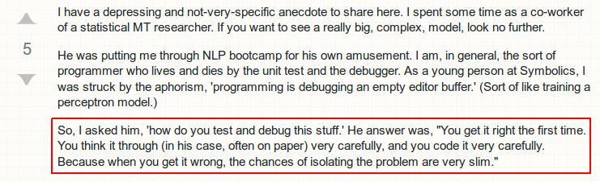

Testing your MCMC code
========================================================
author: Anh Le

Background survey
=======================================================

bit.ly/mcmc_test

Motivation
======================================================


Why is it difficult?
========================
- Output is non-deterministic
- Takes a long time to get one result, hard to test rapidly
- Hard to tell if "bad" result is due to slow mixing, or real bugs

Appealing?
========================================================
width: 1900
height: 800
```
myModel <- model(theta_prior = NormalDistribution(1.9, 0.95**2),
                 sigma2_prior = InverseGammaDistribution(0.5, 0.01 / 2))

res_theta <- rep(NA, 1000) ; res_sigma2 <- rep(NA, 1000)

for (iter in 1:1000) {
  if (iter == 1) {
    myState <- state(mean(y), var(y))
  } else {
    myModel$gibbs_step(myState, y)
  }
  
  res_theta[iter] <- myState$get("theta")
  res_sigma2[iter] <- myState$get("sigma2")
}
```

Teaser
========================================================

```
model <- function(theta_prior, sigma2_prior) {
  theta_prior = theta_prior
  sigma2_prior = sigma2_prior
  
  ....
  
  gibbs_step <- function(state, y) {
    new_theta <- cond_theta(state, y)$sample()
    state$set_theta(new_theta)
    
    new_sigma2 <- cond_sigma2(state, y)$sample()
    state$set_sigma2(new_sigma2)
  }
}
```

Model
===================================
- Likelihood
$$
Data = Y_1, \dots, Y_n \sim i.i.d. N(\theta, \sigma^2)
$$

- Prior
$$\begin{align}
p(\theta) &\sim N(\mu_0, \tau^2_0) \\
p(\sigma^2) &\sim Inverse-Gamma(\nu_0 / 2, \nu_0 \sigma^2_0 / 2)
\end{align}$$

- Posterior

$$
\begin{align}
p(\theta | \tilde \sigma^2, Data) &= N(\mu_n, \tau^2_n) \\
p(\tilde \sigma^2 | \theta, Data) &= Gamma(\frac{\nu_n}{2}, \frac{\nu_n \sigma_n^2(\theta)}{2})
\end{align}
$$


Key Test
==================================

We don't know whether our conditional distribution is correct, but we know the joint

So we can use this identity to test
$$
\frac{p(x'|z)}{p(x|z)} = \frac{p(x', z)}{p(x, z)}
$$
